# PEMROGRAMAN WEB 2

- Mebuat dokumen html dengan menggunakan code yang di minta pada ecampus

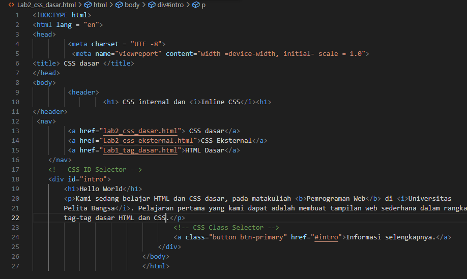

- Hasil yang tela di buat pada code fi atas

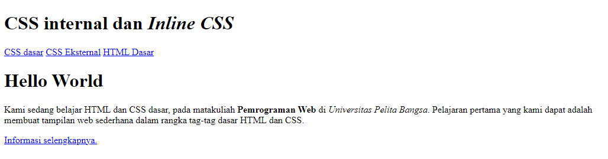

- Mendeklarasikan CSS internal

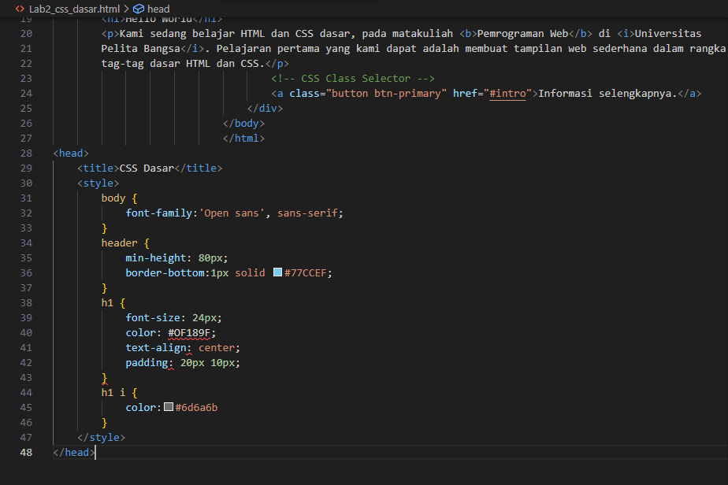

- Hasil dari Mendeklarasikan CSS internal

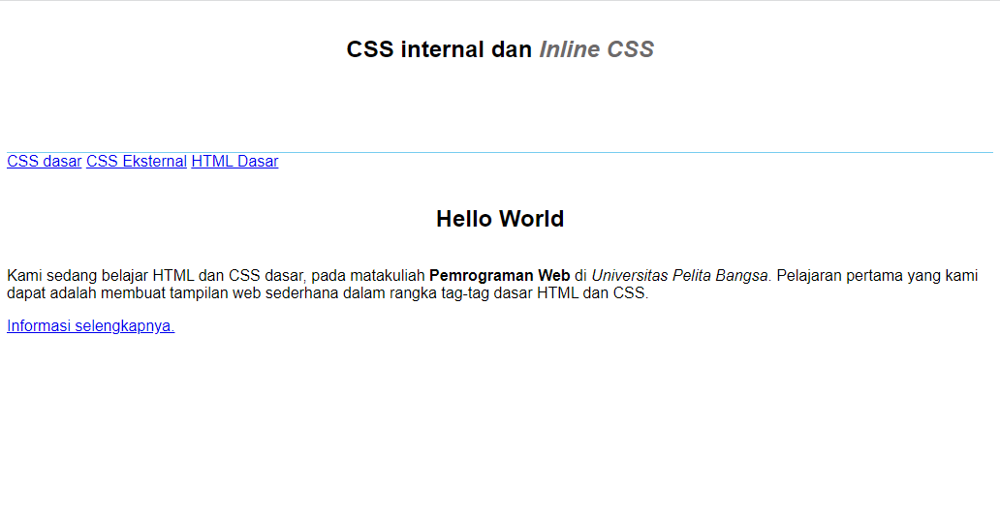

- Menambahkan inline CSS pada dokumen html

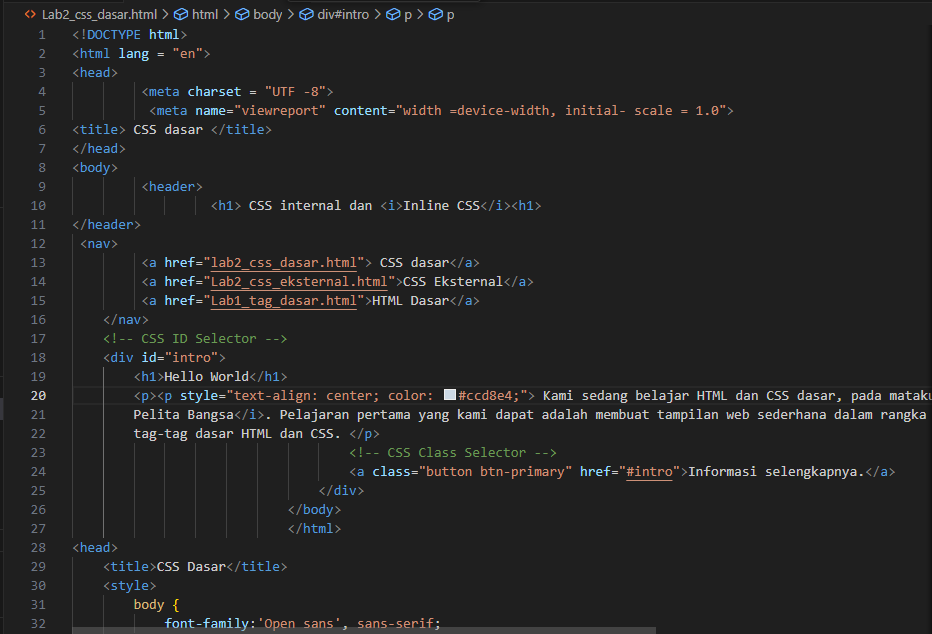

- Hasil dari menambahkan inline CSS

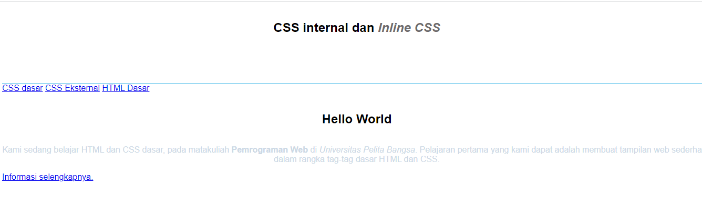

- Membuat CSS eksternal 

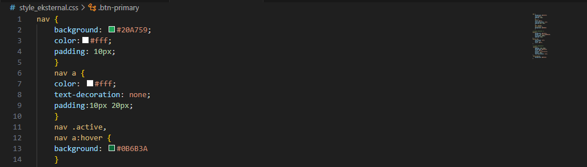

- Menambahkan link 

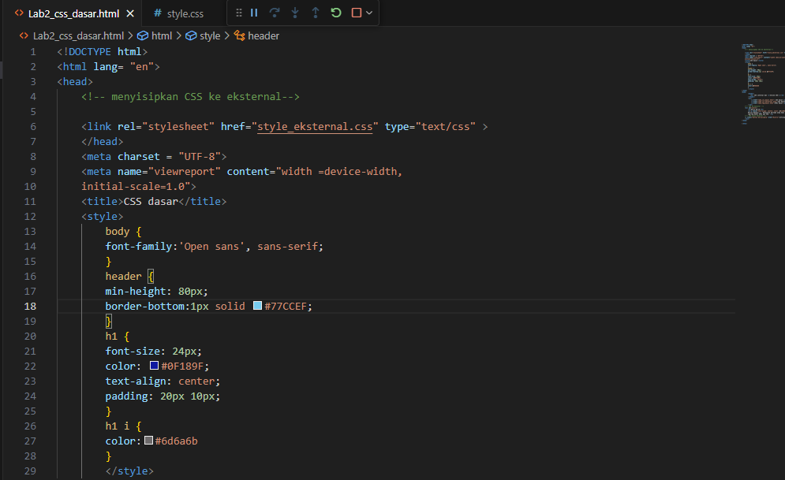

Hasil dari membuat CSS eksternal dan menambahkan link

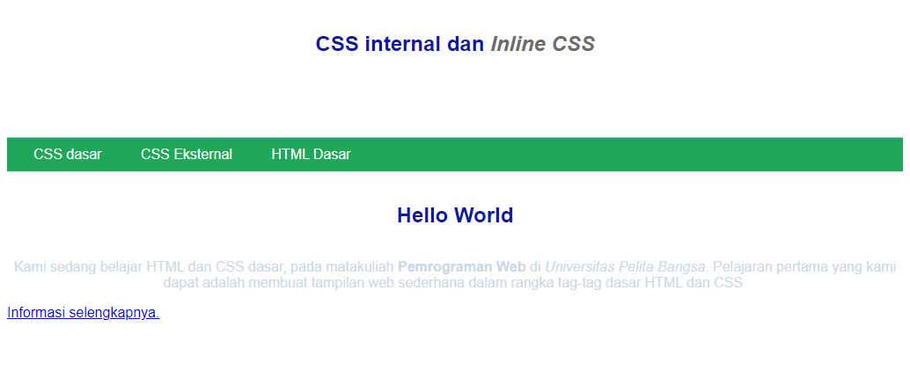

- Menambah CSS selector

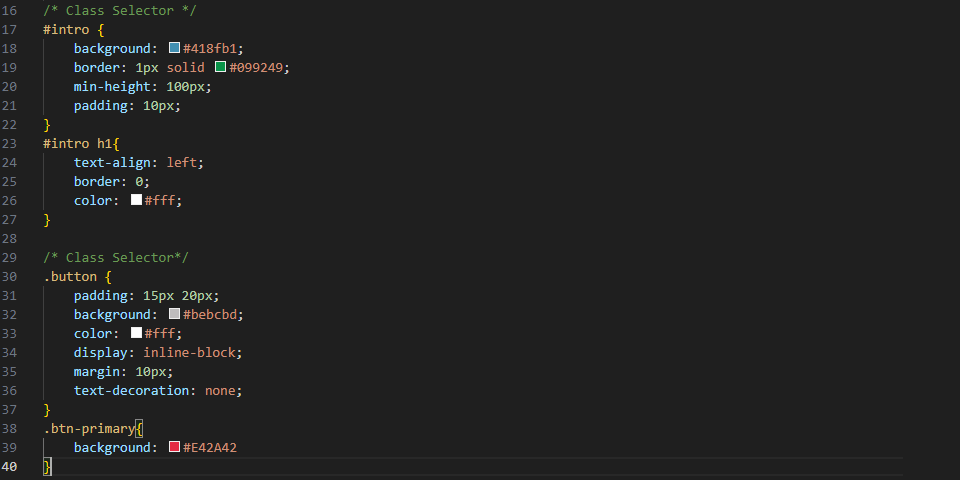

Hasil dari menambahkan CSS selector

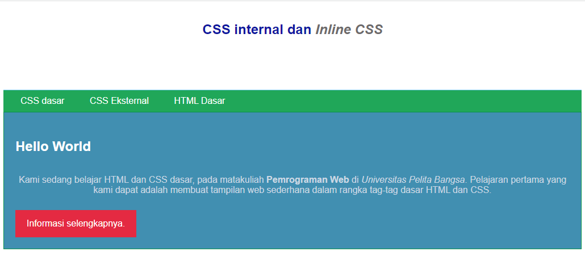

# Pertanyaan atau tugas

Lakukan eksperimen dengan mengubah dan menambah properti dan nilai pada kode CSS dengan mengacu pada CSS Cheat Sheet yang diberikan pada file terpisah dari modul ini.

Apa perbedaan pendeklarasian CSS elemen h1 {...} dengan #intro h1 {...}? berikan penjelasannya!

Apabila ada deklarasi CSS secara internal, lalu ditambahkan CSS eksternal dan inline CSS pada elemen yang sama. Deklarasi manakah yang akan ditampilkan pada browser? Berikan penjelasan dan contohnya!

Pada sebuah elemen HTML terdapat ID dan Class, apabila masing-masing selector tersebut terdapat deklarasi CSS, maka deklarasi manakah yang akan ditampilkan pada browser? Berikan penjelasan dan contohnya! 
(
)

# Jawaban

1. Disini saya mencoba untuk eksperimen membuat elemen dengan box pada html saya sendiri

 Style css nya juga seperti ini

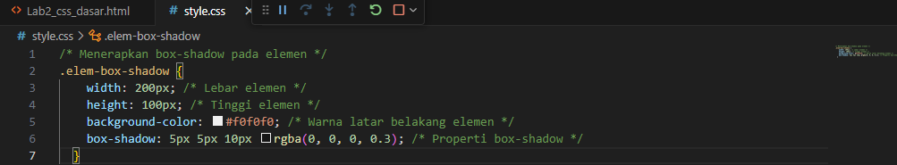

Hasil nya seperti ini pada uji coba nya

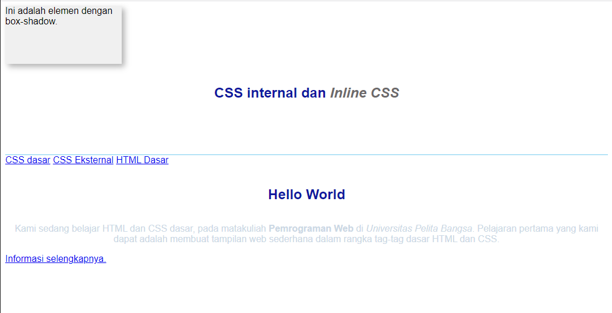

2. h1 {...}itu memberikan sebuah elemen atau style secara menyeluruh.

#intro h1 {...} hanya memberikan sebuah style atau elemen yang ada dalam cakupan intro itu sendiri.

3. Deklarasi css internal tag <style>

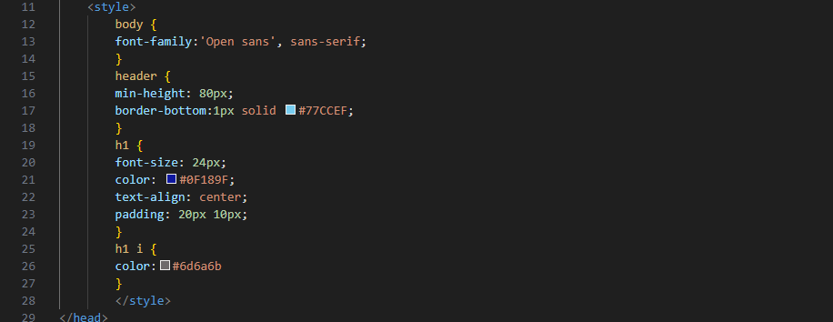

Inline CSS

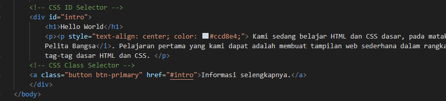

4. ID adalah kebalikan atau hasil sebaliknya dari selector class yang dimana ID hanya bisa di gunakan pada satu halaman saja namun selector class dapat di gunakan di setiap halaman

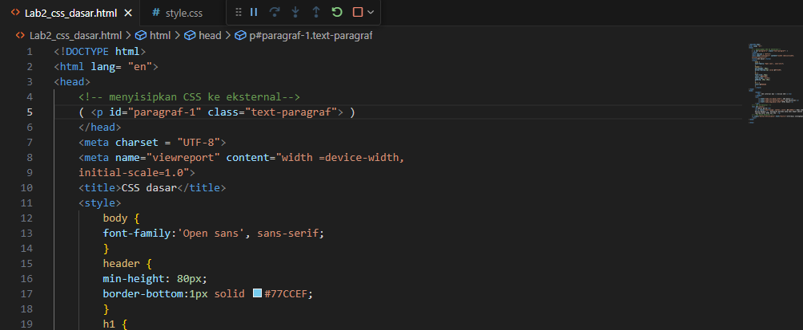

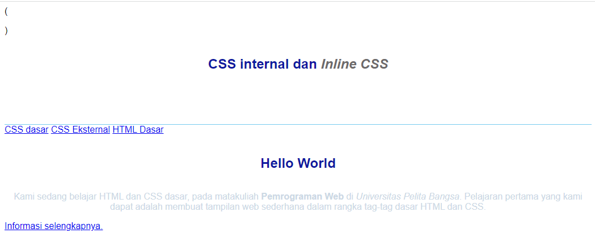
